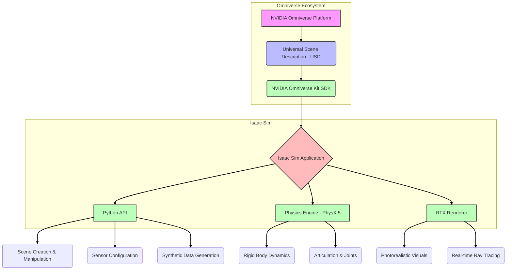

# Chapter 1: Introduction to NVIDIA Isaac Sim

NVIDIA Isaac Sim is a powerful, extensible, and physically accurate open platform for robotics simulation built on NVIDIA Omniverse. It enables the development, testing, and deployment of AI-powered robots by providing a highly realistic virtual environment.

## Key Features:

*   **Physically Accurate Simulation**: Utilizes NVIDIA PhysX 5 for realistic physics interactions.
*   **Photorealistic Rendering**: Powered by Omniverse RTX Renderer for high-fidelity visuals.
*   **Synthetic Data Generation**: Advanced tools for generating diverse and labeled datasets for AI training.
*   **ROS/ROS 2 Integration**: Seamless connectivity with popular robotics middleware.
*   **Python API**: Programmatic control over all aspects of the simulation.
*   **Extensibility**: Build custom tools, assets, and workflows using the Omniverse Kit SDK.

## Use Cases:

*   **Robot Development & Testing**: Rapidly prototype, test, and validate robot behaviors in a safe, virtual environment.
*   **AI Training**: Generate large-scale, diverse synthetic datasets for training deep learning models (e.g., for object detection, pose estimation, navigation).
*   **Algorithm Development**: Experiment with new control algorithms, perception systems, and autonomous navigation strategies.
*   **Digital Twins**: Create virtual replicas of real-world factories, warehouses, or environments for optimization and monitoring.

Isaac Sim addresses critical challenges in robotics development, such as the difficulty and cost of real-world data collection, the danger of physical testing, and the complexity of hardware setup. By providing a virtual proving ground, it accelerates the entire robotics development lifecycle.

## Core Architecture

Isaac Sim is built on the **NVIDIA Omniverse** platform, which provides a powerful foundation for 3D simulation and collaboration. At its heart, Omniverse utilizes **Universal Scene Description (USD)**, an open-source 3D scene description technology developed by Pixar.

### Key Architectural Components:

*   **Universal Scene Description (USD)**: USD serves as the fundamental scene representation within Isaac Sim. It allows for the description, assembly, interchange, and collaborative editing of 3D scenes. Everything in an Isaac Sim environment, from robots and sensors to environments and physics properties, is represented in USD.
*   **NVIDIA Omniverse Kit**: This is a modular SDK for building Omniverse applications and microservices. Isaac Sim is an application built on Omniverse Kit, providing a framework for developing extensions, tools, and custom workflows. The Kit allows for hot-reloading of changes, enabling rapid iteration.
*   **Isaac Sim Python API**: A comprehensive Python API exposes virtually all functionalities of Isaac Sim, allowing users to programmatically control the simulation. This includes scene creation, robot manipulation, sensor configuration, physics control, and synthetic data generation. The API is built on top of the Omniverse Kit API.
*   **Physics Engine (PhysX 5)**: NVIDIA PhysX 5 provides highly realistic and accurate physics simulation for rigid bodies, articulations, and soft bodies. This ensures that robot interactions with the environment and other objects behave as they would in the real world, which is crucial for training and validation.
*   **Omniverse RTX Renderer**: For photorealistic visuals, Isaac Sim leverages the real-time ray tracing capabilities of the Omniverse RTX Renderer. This enables accurate lighting, reflections, and refractions, which are vital for training vision-based AI models where visual fidelity impacts transferability to the real world.

This modular architecture, centered around USD and accessible via the Python API, makes Isaac Sim an incredibly flexible and powerful tool for advanced robotics research and development.

## Installation & Setup

Installing NVIDIA Isaac Sim typically involves several steps, including setting up your NVIDIA drivers, Docker (with NVIDIA Container Toolkit), and then downloading and installing Isaac Sim itself. This section provides a high-level overview; always refer to the [official NVIDIA Isaac Sim documentation](https://docs.omniverse.nvidia.com/app_isaacsim/app_isaacsim/overview.html) for the most up-to-date and detailed instructions.

### Prerequisites:

1.  **NVIDIA GPU**: An RTX series GPU (e.g., RTX 3080/4080 or newer) with at least 10-12GB VRAM is recommended.
2.  **NVIDIA Drivers**: Ensure you have the latest stable NVIDIA GPU drivers installed.
3.  **Operating System**: Ubuntu 20.04 or 22.04 LTS is typically required for full compatibility with Isaac Sim and its dependencies.
4.  **Docker & NVIDIA Container Toolkit**: These are often used for running Isaac Sim in a containerized environment, ensuring reproducibility and dependency management.

### High-Level Installation Steps:

1.  **Install NVIDIA Drivers**: Follow NVIDIA's instructions for installing the correct drivers for your GPU.
2.  **Install Docker & NVIDIA Container Toolkit**: Set up Docker and the NVIDIA Container Toolkit according to their official guides.
3.  **Download Isaac Sim**: Access the NVIDIA Omniverse Launcher (or directly download the AppImage/Container) from the NVIDIA Developer website.
4.  **Launch Isaac Sim**: Depending on your installation method (AppImage, Docker container, or Omniverse Launcher), launch Isaac Sim. You may need to accept EULAs and configure initial settings.
5.  **Install Isaac Sim Extensions**: Within Isaac Sim, ensure necessary extensions are enabled or installed (e.g., ROS/ROS 2 Bridge, Synthetic Data).
6.  **Verify Installation**: Run a basic example or the "Hello World" script provided with Isaac Sim to ensure everything is working correctly.

It is highly recommended to follow the official documentation precisely, as installation steps can be sensitive to system configuration and versioning. Pay close attention to environment variables and potential `apt` package conflicts.

## UI Navigation

NVIDIA Isaac Sim provides a rich graphical user interface (GUI) for inspecting, manipulating, and debugging simulation environments. While much of the interaction can be done programmatically via the Python API, understanding the UI is crucial for scene setup, visual verification, and initial exploration.

### Key UI Elements:

*   **Viewport**: The central area displaying the 3D simulation scene. You can navigate the viewport using standard 3D controls (e.g., W, A, S, D for movement, mouse for camera rotation/panning).
*   **Stage Window**: Located on the left, this panel displays the hierarchy of all USD prims (primitives/objects) in your scene. You can select, hide, or lock objects here.
*   **Property Window**: On the right, this panel shows the attributes and properties of the currently selected object. This includes transform (position, rotation, scale), visual properties (materials, textures), and physics properties (mass, collision).
*   **Toolbar**: At the top, containing buttons for common actions like Play/Pause simulation, saving/loading scenes, adding basic primitives, and accessing extensions.
*   **Extensions Window**: (Window -> Extensions) This critical panel allows you to enable, disable, and manage various Isaac Sim extensions, such as the ROS/ROS 2 Bridge, Synthetic Data Recorder, and others. Many functionalities are provided as extensions.
*   **Console Window**: (Window -> Console) Displays logs, errors, and output from your Python scripts. Essential for debugging.

### Basic Navigation Controls:

*   **Orbit Camera**: Alt + Left-click and drag.
*   **Pan Camera**: Alt + Middle-click and drag.
*   **Zoom Camera**: Alt + Right-click and drag (or mouse scroll wheel).
*   **Fly Camera (WASD)**: Press `W`, `A`, `S`, `D` to move forward, left, backward, right. `Q` and `E` for up/down.
*   **Focus on Object**: Select an object in the Stage window and press `F`.

Familiarity with these UI elements and controls will significantly enhance your workflow, especially when visually debugging complex simulation scenarios or setting up initial scenes before automating with Python.

## Basic Scene Creation

One of the primary uses of Isaac Sim is to programmatically create and manipulate 3D scenes. The Python API provides extensive functionalities to build complex environments, add primitive shapes, import assets, and arrange them as needed. This section covers the basics of creating a new simulation stage and adding simple objects.

### Core Concepts:

*   **Stage**: In USD, the stage is the root of the scene graph. All objects, lights, and cameras are added to the stage.
*   **Prim (Primitive)**: A fundamental building block in USD. Prims can represent anything from a simple shape (sphere, cube) to a complex robot model, a camera, or a light source.
*   **Context**: The `omni.isaac.kit.SimulationApp` provides the simulation context, which must be initialized before interacting with Isaac Sim.
*   **World**: The `omni.isaac.core.World` object manages the simulation environment, including physics, rendering, and timing.

### Example: Creating a Simple Scene

To get started, let's create an empty stage, add a ground plane (essential for objects to rest on), and then add a simple cube. This script can be run directly from a Python environment with Isaac Sim properly configured, or as an extension within Isaac Sim.

```python
from omni.isaac.kit import SimulationApp

# Start up Isaac Sim
kit = SimulationApp({"headless": False})

from omni.isaac.core import World
from omni.isaac.core.prims import XformPrim, RigidPrim
from omni.isaac.core.utils.nucleus import get_assets_root_path
from omni.isaac.core.utils.stage import open_stage_as_new

import asyncio

async def create_simple_scene():
    # Open a new empty stage
    open_stage_as_new()

    # Initialize the World object
    world = World(stage_units_in_meters=1.0) # 1.0 means 1 meter in USD
    await world.initialize_simulation()

    # Add a ground plane
    # We use a built-in asset for simplicity
    assets_root_path = get_assets_root_path()
    if assets_root_path is None:
        print("Could not find Isaac Sim assets folder")
        kit.shutdown()
        return

    ground_plane_path = assets_root_path + "/Props/Shapes/Motion_Board.usd"
    world.scene.add_ground_plane(prim_path="/World/defaultGroundPlane", usd_path=ground_plane_path)

    # Add a simple rigid body (e.g., a cube)
    cube_prim = world.scene.add_default_ground_plane(prim_path="/World/myCube", position=[0.0, 0.0, 1.0], scale=[0.5, 0.5, 0.5])
    # For rigid bodies, you often want a physics material
    # world.scene.add_physics_material(prim_path="/PhysicsMaterial", static_friction=0.5, dynamic_friction=0.5, restitution=0.1)
    # cube_prim.apply_physics_material("/PhysicsMaterial")

    print("Scene created successfully! Press Play in Isaac Sim UI or run world.run() to simulate.")

    # You can keep the simulation running for interaction
    # while True:
    #     await world.step_async()

# Run the async function
asyncio.run(create_simple_scene())

# Keep the app running if not in headless mode
kit.run()
kit.shutdown()
```

This script demonstrates the basic steps: initializing the simulation app, creating a world, adding a ground plane, and adding a primitive shape. The `prim_path` is crucial as it defines the object's location in the USD stage hierarchy.

## Physics Simulation

Realistic physics simulation is fundamental to robotics. Isaac Sim leverages NVIDIA PhysX 5 to provide a high-fidelity physics engine that accurately models interactions between rigid bodies, articulations (robots), and environments. Understanding how to configure and interact with the physics engine is vital for creating believable and useful simulations.

### Key Physics Concepts:

*   **Rigid Body**: An object that maintains a fixed shape and size, but can move and rotate. Most static and dynamic objects in a simulation (e.g., cubes, spheres, robot links) are rigid bodies.
*   **Collision Shapes**: Define the geometric representation of an object for collision detection. They can be simple (sphere, box, capsule) or complex (mesh).
*   **Physics Material**: Determines how rigid bodies interact during collisions, defining properties like friction (static and dynamic) and restitution (bounciness).
*   **Gravity**: The default force acting on all physics-enabled objects. Isaac Sim allows you to customize gravity settings.
*   **Articulation**: A collection of rigid bodies connected by joints (e.g., a robot arm). PhysX handles the complex dynamics of articulated systems.

### Example: Applying Physics Properties

Building on the previous scene creation example, we can add physics properties to our cube to make it react to gravity and collide with the ground plane. Isaac Sim's Python API allows direct manipulation of these properties.

```python
from omni.isaac.kit import SimulationApp

kit = SimulationApp({"headless": False})

from omni.isaac.core import World
from omni.isaac.core.prims import RigidPrim
from omni.isaac.core.utils.nucleus import get_assets_root_path
from omni.isaac.core.utils.stage import open_stage_as_new

import asyncio

async def simulate_physics_scene():
    open_stage_as_new()

    world = World(stage_units_in_meters=1.0)
    await world.initialize_simulation()

    assets_root_path = get_assets_root_path()
    if assets_root_path is None:
        print("Could not find Isaac Sim assets folder")
        kit.shutdown()
        return

    ground_plane_path = assets_root_path + "/Props/Shapes/Motion_Board.usd"
    world.scene.add_ground_plane(prim_path="/World/defaultGroundPlane", usd_path=ground_plane_path)

    # Add a sphere with physics enabled
    sphere_prim = world.scene.add(RigidPrim(
        prim_path="/World/mySphere",
        position=[0.0, 0.0, 5.0],  # Start higher up to observe fall
        scale=[0.5, 0.5, 0.5],
        mass=1.0, # Add mass to make it a rigid body
        # collision_enabled=True # By default, RigidPrim has collision enabled
    ))

    # Optionally add a physics material to customize interactions
    # from omni.isaac.core.materials import PhysicsMaterial
    # physics_material = PhysicsMaterial(prim_path="/PhysicsMaterials/myMaterial", static_friction=0.5, dynamic_friction=0.5, restitution=0.7)
    # sphere_prim.apply_physics_material(physics_material)

    print("Scene with physics created. Starting simulation...")

    # Simulate for a few seconds
    for i in range(500):
        await world.step_async()
        if i % 100 == 0:
            print(f"Sphere position: {sphere_prim.get_world_pose()[0]}")

    print("Simulation finished.")

# Run the async function
asyncio.run(simulate_physics_scene())

kit.shutdown()
```

In this example, we add a `RigidPrim` (a sphere) and assign it a mass, which automatically enables physics simulation for that object. When the simulation runs (`await world.step_async()`), the sphere will fall under gravity and collide with the ground plane according to physical laws. You can experiment with `position`, `mass`, and `scale` to observe different behaviors.

## Isaac Sim Architecture Overview



_Figure 1: High-level overview of the NVIDIA Isaac Sim architecture within the Omniverse Ecosystem. USD acts as the universal language, managed by the Omniverse Kit, which forms the foundation for the Isaac Sim application. The Python API, Physics Engine (PhysX), and RTX Renderer are core components of Isaac Sim, enabling programmatic control, realistic simulation, and photorealistic rendering._

## Practical Task: Install Isaac Sim and Run Hello World

**Objective**: Successfully install NVIDIA Isaac Sim and execute a basic "Hello World" script to verify the environment setup.

**Success Criteria**:

*   Isaac Sim application launches without errors.
*   A Python script successfully connects to Isaac Sim and prints a message to the console or logs.

**Instructions**:

1.  **Review Installation & Setup**: Refer to the "Installation & Setup" section in this chapter for prerequisites and high-level steps.
2.  **Follow Official Documentation**: **Crucially**, navigate to the [official NVIDIA Isaac Sim documentation](https://docs.omniverse.nvidia.com/app_isaacsim/app_isaacsim/overview.html) and follow the detailed installation guide specific to your operating system and preferred installation method (e.g., Omniverse Launcher, Docker).
3.  **Launch Isaac Sim**: Once installed, launch the Isaac Sim application.
4.  **Run a Basic Script**: Open your preferred Python IDE or text editor. Create a new Python file (e.g., `hello_isaac.py`) and add the following minimal code:

    ```python
    from omni.isaac.kit import SimulationApp

    # Start up Isaac Sim in headless mode (no UI) or with UI by setting headless=False
    kit = SimulationApp({"headless": False})

    print("Hello from Isaac Sim Python API!")

    # You can perform some basic actions here if the UI is open, e.g., load a stage
    # from omni.isaac.core import World
    # world = World()
    # world.scene.add_ground_plane()
    # world.run()

    # Shut down Isaac Sim when done
    kit.shutdown()
    print("Isaac Sim shut down.")
    ```

5.  **Execute the Script**: Run this Python script. If `headless=False`, Isaac Sim should launch its UI (or connect to an already running instance if configured). The "Hello from Isaac Sim Python API!" message should appear in your Python console or in the Isaac Sim console window (Window -> Console).

**Troubleshooting**: If you encounter issues, carefully review the official NVIDIA Isaac Sim documentation, check your GPU drivers, Docker setup, and ensure all required Omniverse extensions are enabled. The console logs within Isaac Sim are invaluable for debugging.

## Practical Task: Create Empty Stage, Add Ground Plane and Sphere

**Objective**: Use the Isaac Sim Python API to programmatically create a simulation environment with a ground plane and a physics-enabled sphere.

**Success Criteria**:

*   A new Isaac Sim stage is created and visible (if not in headless mode).
*   A ground plane is successfully added to the stage.
*   A sphere primitive is added to the scene at a specified position and falls under gravity upon simulation.
*   No errors are reported in the Isaac Sim or Python console.

**Instructions**:

1.  **Reference Code**: Open the `isaac-sim-basic-setup.py` file in `AIdd-book/code-examples/module-3/`.
2.  **Adapt the Script**: Modify the provided `create_simple_scene` (or `simulate_physics_scene`) function to:
    *   Ensure an empty stage is opened.
    *   Add a ground plane using `world.scene.add_ground_plane()`.
    *   Add a `RigidPrim` (e.g., a sphere or cube) with a `prim_path`, `position`, `scale`, and `mass` attribute. Ensure the `position` is high enough (e.g., `z=5.0`) for the object to fall.
3.  **Execute and Observe**: Run your modified Python script. In the Isaac Sim UI, press the "Play" button (or ensure `kit.run()` or `world.step_async()` is called in your script if running headless/programmatically). Observe the sphere falling onto the ground plane.
4.  **Verification**: Confirm the sphere falls and interacts realistically with the ground plane.

**Hint**: You can use `from omni.isaac.core.prims import RigidPrim` to easily add physics-enabled primitives. Remember to initialize `World` and call `await world.initialize_simulation()`.

## Practical Task: Experiment with Physics Properties

**Objective**: Modify the simulation to experiment with different physics properties such as mass, friction, and restitution, observing their impact on object behavior.

**Success Criteria**:

*   The sphere (or other primitive) demonstrates varied falling and bouncing behaviors based on altered physics properties.
*   No errors are reported in the Isaac Sim or Python console.
*   You can articulate how changing specific properties affects the simulation.

**Instructions**:

1.  **Reference Code**: Continue using your modified `isaac-sim-basic-setup.py` file from the previous task, or use the `simulate_physics_scene` example in the "Physics Simulation" section of this chapter.
2.  **Experiment with Mass**: Change the `mass` property of your sphere (or cube). Observe if a heavier object falls faster or slower (it won't in a vacuum, but perception of impact might change) or how it interacts differently with other objects if you add more. You can set mass directly in `RigidPrim` constructor or using `prim.set_mass(new_mass)`.
3.  **Experiment with Restitution (Bounciness)**:
    *   Isaac Sim allows you to apply `PhysicsMaterial` to prims. Import `PhysicsMaterial` from `omni.isaac.core.materials`.
    *   Create a physics material with different `restitution` values (0.0 for no bounce, 1.0 for perfect bounce) and apply it to your sphere using `sphere_prim.apply_physics_material(physics_material)`.
    *   Observe how the sphere's bounce height changes.
4.  **Experiment with Friction**: Modify `static_friction` and `dynamic_friction` properties in your `PhysicsMaterial`.
    *   Add another object (e.g., a ramp or another cube) and make the sphere slide or roll over it.
    *   Observe how different friction values affect sliding, rolling, and coming to a stop.

**Exploration Questions**:

*   Does changing the mass of an object affect its fall speed in Isaac Sim?
*   How does a `restitution` value of 0.5 compare to 0.9?
*   What happens if an object has very low `dynamic_friction` on a sloped surface?

By manipulating these properties, you gain a deeper understanding of how physical accuracy is achieved and controlled within Isaac Sim, which is crucial for creating realistic robot interactions.
